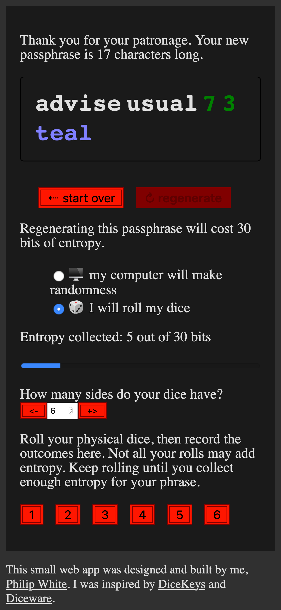

# phrase.shop #

[**phrase.shop**](https://phrase.shop) is a small web app to generate secure yet memorable passphrases.

## Purpose

* [You Should Probably Change Your Password](https://www.youtube.com/watch?v=aHaBH4LqGsI)
* [How long should my passphrase be?](http://world.std.com/~reinhold/dicewarefaq.html#howlong)

## Design principles

* Strong passphrases are for everyone, including those who don't care about or understand entropy, and including those with limited English.
* App is engaging and educational for those who understand, or want to learn, about entropy.
* Shop theme: you are buying passphrase components, paying for them with entropy.

## Dice

While any modern computer's randomness is just fine, using physical dice is more fun.

I like [hexadecimal (16-sided) dice from Gamescience](https://www.gamescience.com/D16--16-Sided-Dice_c_20.html).
I have three of these, bought specifically for this project.
I roll all three at a time, for 12 bits of entropy per roll.
This makes generating even the longest passphrase a breeze.

Gamescience also sells a [100-sided monster of a dice](https://www.gamescience.com/D100--100-Sided-Dice_c_25.html),
which would yield a massive 6 bits of entropy per roll.

## Developing

I welcome your contributions.
In particular, I'm very supportive of newbie developers.

If you are new to developing web applications, I recommend the book
[_Test-Driven React_](https://pragprog.com/titles/tbreact/test-driven-react/).
This book shaped and gave me confidence for this project by introducing me to
[Jest](https://jestjs.io/),
[Enzyme](https://enzymejs.github.io/enzyme/), and
[Wallaby](https://wallabyjs.com/).

The workflow I propose:

1. Decide what to work on.
   Before starting development, please open an issue for your desired change so we can discuss it and align
   on _whether_ it needs to be addressed and _how_ to address it.
   If you don't lead with an issue, you risk wasting your time developing something I'll disagree with and won't accept.

2. Work on your changes.
   See next sections for how to run this project locally.

3. Run `npm run build` before submitting a pull request and resolve any linter and unit test errors.

4. Submit a pull request on GitHub.
   Check that your change passes the Continuous Integration workflow.
   I'll review your contribution, and we'll either have a discussion or I'll accept it as-is.

5. You'll see your contribution on https://phrase.shop!

### Running phrase.shop locally

Install [`npm`](https://www.npmjs.com/) using whatever
means is most convenient for you, such as [Homebrew](https://brew.sh/) on macOS.

Initialize:

    $ npm install
 
This creates a `node_modules` directory.

Run unit tests:

    $ npm test

Run the app locally:

    $ npm start

This supports hot-reloading, so feel free to edit Javascript and see your changes
in the browser immediately.

Run linter and generate final artifacts:

    $ npm run build

This produces the app bundle Javascript that's served to real customers.
If any part of this process fails, please fix any issues before submitting a pull request.

### React/TS template

The React/TS template for this web app came from https://github.com/philipmw/spa-template.

### favicon

I made the favicon with Inkscape 1.0, with all the creativity that I could muster.
